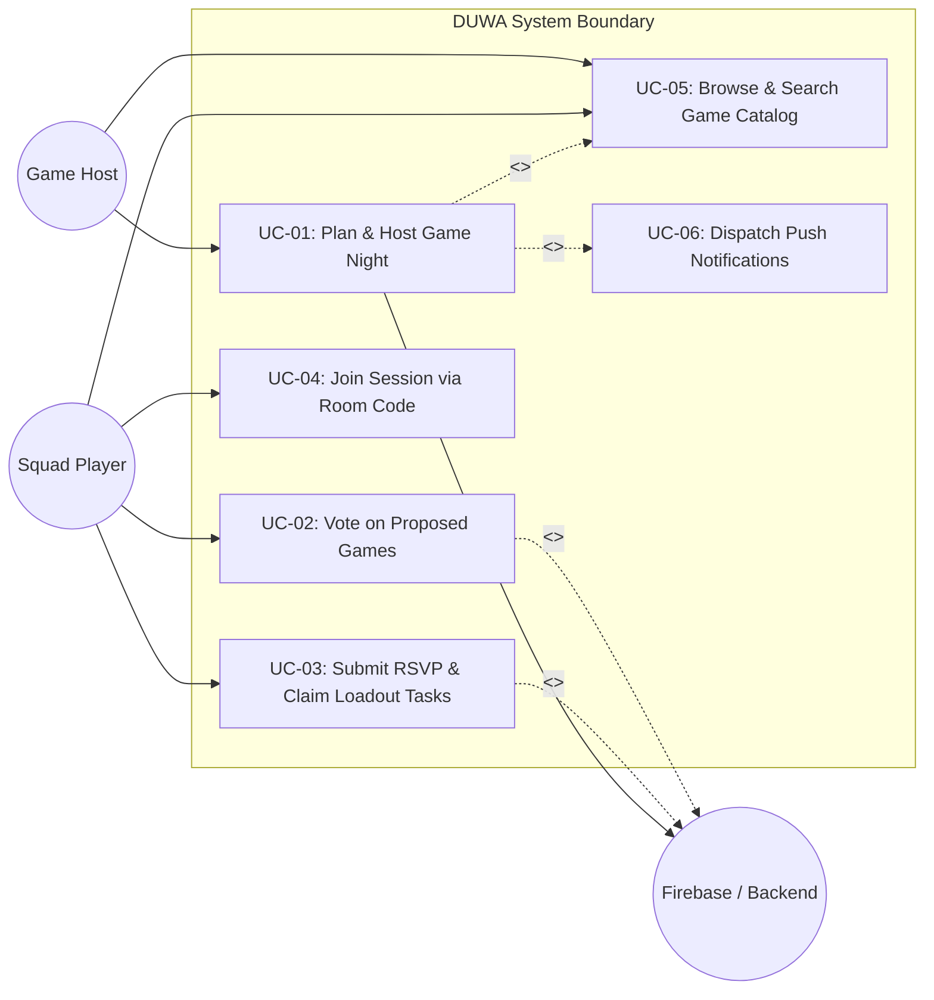
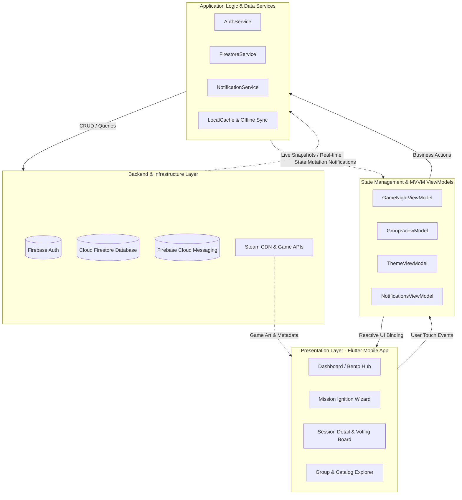
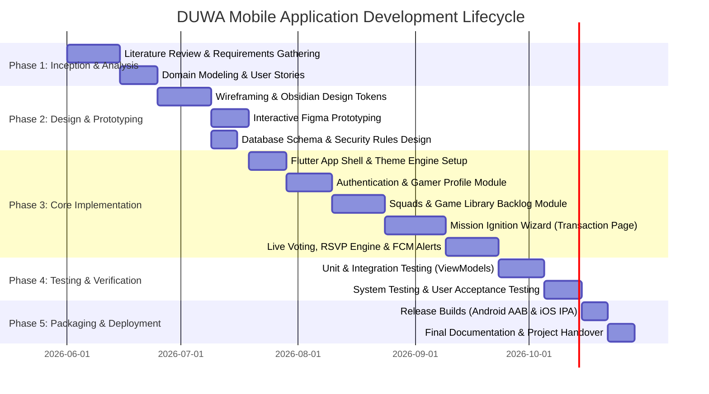

# CHAPTER 2: CONCEPTUALIZING THE MOBILE APPLICATION

## Project Title: DUWA – Social Game Night Coordination & Tabletop Hub
**Target Platform:** Mobile (Flutter / Android & iOS)  
**Backend Infrastructure:** Firebase (Authentication, Cloud Firestore, Cloud Messaging)  
**Primary Design Philosophy:** Editorial, Cinematic, Tactile (Obsidian Void Design System)

---

## VI. Wireframes

### 1. Dashboard Wireframe (`HomeView` / Bento Command Hub)
The dashboard provides a consolidated overview of active gaming circles, the immediate next game night, pending RSVPs, and quick-action shortcuts.

```text
+-----------------------------------------------------------------+
|  [⬡ DUWA]                   ● Online                 [🔔 2] [👤]|
+-----------------------------------------------------------------+
|  WELCOME BACK, ALEX                                             |
|  3 days since your last session • The Meeple Guild              |
+-----------------------------------------------------------------+
|  (!) ACTION REQUIRED: PENDING INVITATION                        |
|  "Catan & Wingspan Night" hosted by Marco                       |
|  [ Accept ]              [ Tentative ]             [ Decline ]  |
+-----------------------------------------------------------------+
|  NEXT GAME NIGHT (HERO SESSION MARQUEE)                         |
|  +-----------------------------------------------------------+  |
|  | [KEY ART BANNER: TERRAFORMING MARS]                       |  |
|  | Saturday, Oct 24 • 7:30 PM (Starts in 1d 4h)              |  |
|  | Venue: Marco's Table • 124 Elm St (or Discord #voice)     |  |
|  | Squad: [A1] [A2] [A3] [A4] (4/5 Confirmed)                |  |
|  | Loadout: Food (Pizza ordered) | Drinks (Unassigned)       |  |
|  |-----------------------------------------------------------|  |
|  | My RSVP:  (•) GOING       ( ) MAYBE       ( ) CAN'T GO    |  |
|  +-----------------------------------------------------------+  |
+-----------------------------------------------------------------+
|  ACTION COMMAND BENTO HUB                                       |
|  +-----------------------------+  +--------------------------+  |
|  |  🚀 PLAN A SESSION          |  |  🔑 ENTER ROOM CODE      |  |
|  |  Ignite a game night with   |  |  Join session with PIN   |  |
|  |  your squad in 3 quick steps|  +--------------------------+  |
|  |  [ + Start Planning ]       |  |  🎲 RANDOM GAME PICKER   |  |
|  |                             |  |  Spin squad backlog      |  |
|  +-----------------------------+  +--------------------------+  |
+-----------------------------------------------------------------+
|  UPCOMING SESSIONS                                 See All (3) >|
|  +-----------------------------------------------------------+  |
|  | [Art] ROOT: Woodland War • Wed, 8:00 PM • 4/4 Ready       |  |
|  +-----------------------------------------------------------+  |
|  | [Art] DUNE: IMPERIUM • Nov 02, 6:00 PM • Voting Active 🗳️ |  |
|  +-----------------------------------------------------------+  |
+-----------------------------------------------------------------+
|  RECENT SESSIONS ARCHIVE                                        |
|  +-----------------------------------------------------------+  |
|  | CLANK! IN! SPACE! • Oct 14 • Won by Alex • 92m duration   |  |
|  +-----------------------------------------------------------+  |
+-----------------------------------------------------------------+
|      [ 🏠 Home ]      [ 📅 Sessions ]      [ 👥 Squads ]        |
+-----------------------------------------------------------------+
```

#### Dashboard UI Specifications:
* **Top Navigation Bar:** Persistent status bar displaying brand logo, connectivity presence indicator, unread notifications badge button, and user profile avatar.
* **Briefing Header:** Welcoming personalized greeting highlighting user's handle, group affiliation, and days since the last recorded game session.
* **Contextual Priority Banner:** Dynamic high-priority card that appears automatically whenever the user has an unacknowledged invitation, an active game ballot, or unassigned prep tasks.
* **Hero Session Marquee:** High-impact editorial showcase card featuring live Steam/board game key art, scheduled countdown, venue details, attendee roster, and 1-tap tactile RSVP response chips.
* **Bento Action Hub:** Tactile grid of primary operations:
  * *Plan a Session:* High-contrast gradient primary card launching the creation wizard.
  * *Enter Room Code:* Modal dialog trigger for 6-digit session room code access.
  * *Random Game Picker:* Instant utility to randomly select a backlog game matching group size.
* **Upcoming Sessions Feed:** Scrollable cards listing upcoming events with RSVP status pills and game thumbnails.
* **Bottom Floating Dock:** Frosted glass capsule navigation bar with quick transitions between *Home*, *Sessions*, and *Squads*.

---

### 2. Main Transaction Page Wireframe (`Mission Ignition: Create Game Night Sheet`)
The primary transaction represents the multi-stage creation, configuration, and dispatch of a game night session.

```text
+-----------------------------------------------------------------+
|  [✕] Cancel              PLAN A GAME NIGHT             (Step 1/3)|
+-----------------------------------------------------------------+
|  PROGRESS: [████████████░░░░░░░░░░░░░░░░░░░░░░░░] 33% Complete  |
+-----------------------------------------------------------------+
|  STAGE 1: LAUNCH TIMING                                         |
|  When is the squad getting together?                            |
|                                                                 |
|  Quick Presets:                                                 |
|  [ Tonight, 8:00 PM ]             [ Tomorrow, 7:30 PM ]         |
|  [ Friday Night Raid ]            [ Weekend Afternoon ]         |
|                                                                 |
|  Custom Schedule:                                               |
|  Date: [ Saturday, October 24, 2026                 📅 Pick ]   |
|  Time: [ 07:30 PM                                   ⏰ Pick ]   |
|                                                                 |
|  Target Squad / Circle:                                         |
|  Group: [ The Meeple Guild                                ▼ ]   |
+-----------------------------------------------------------------+
|                                                   [ Next Step >]|
+-----------------------------------------------------------------+
```
*(User advances to Stage 2: Target Game Selection)*
```text
+-----------------------------------------------------------------+
|  [< Back]                PLAN A GAME NIGHT             (Step 2/3)|
+-----------------------------------------------------------------+
|  PROGRESS: [████████████████████████░░░░░░░░░░░░] 66% Complete  |
+-----------------------------------------------------------------+
|  STAGE 2: TARGET GAME                                           |
|  What game is hitting the table?                                |
|                                                                 |
|  Squad Voting Mode:                                             |
|  [  Let squad vote between 2 to 4 nominated games         [x] ] |
|                                                                 |
|  [ 🔍 Search Group Library or Steam Catalog...                ] |
|                                                                 |
|  Select Nominated Games (Choose up to 4):                       |
|  +---------------------------+   +---------------------------+  |
|  | [Art] TERRAFORMING MARS   |   | [Art] DUNE: IMPERIUM      |  |
|  | 1-5 Players • 120 mins    |   | 1-4 Players • 90 mins     |  |
|  | [ ✓ NOMINATED ]           |   | [ ✓ NOMINATED ]           |  |
|  +---------------------------+   +---------------------------+  |
|  | [Art] WINGSPAN            |   | [Art] CATAN               |  |
|  | 1-5 Players • 60 mins     |   | 3-4 Players • 75 mins     |  |
|  | [ + Add to Ballot ]       |   | [ + Add to Ballot ]       |  |
|  +---------------------------+   +---------------------------+  |
|                                                                 |
|  Can't find your game? [ + Add Custom Board Game ]              |
+-----------------------------------------------------------------+
|  [< Back]                                         [ Next Step >]|
+-----------------------------------------------------------------+
```
*(User advances to Stage 3: Squad & Loadout Logistics)*
```text
+-----------------------------------------------------------------+
|  [< Back]                PLAN A GAME NIGHT             (Step 3/3)|
+-----------------------------------------------------------------+
|  PROGRESS: [████████████████████████████████████] 100% Ready    |
+-----------------------------------------------------------------+
|  STAGE 3: SQUAD & LOADOUT LOGISTICS                             |
|                                                                 |
|  Location & Venue:                                              |
|  (•) In-Person Table: [ Marco's Basement Table, 124 Elm St    ] |
|  ( ) Virtual Session: [ Discord Voice / Meet URL              ] |
|                                                                 |
|  Loadout & Supplies Checklist:                                  |
|  [✓] Snacks:  [ 2x Large Pepperoni Pizza   ]  Claimed: Alex (Host)
|  [✓] Drinks:  [ Cold Brew & Soda Cans      ]  Claimed: Ken      |
|  [ ] Equipment: [ Sleeves & Extra Dice     ]  [ Claim Task ]    |
|  [ + Add Supply Item ]                                          |
|                                                                 |
|  SUMMARY PREVIEW:                                               |
|  "The Meeple Guild • Sat Oct 24, 7:30 PM • 2 Nominated Games"   |
+-----------------------------------------------------------------+
|  [ 🚀 IGNITE & DISPATCH GAME NIGHT                            ] |
+-----------------------------------------------------------------+
```
*(Submission Success Modal Overlay)*
```text
+-----------------------------------------------------------------+
|                       🎉 GAME PASS MINTED!                      |
|                                                                 |
|                  ROOM PASS CODE: #GM-948210                     |
|                                                                 |
|     Invitations and push notifications dispatched to 5 squad    |
|     members of 'The Meeple Guild'.                              |
|                                                                 |
|     [ 📋 Copy Invite Link ]     [ 💬 Share to Discord/WhatsApp ]|
|                                                                 |
|                 [ Done & Open Session Board ]                   |
+-----------------------------------------------------------------+
```

---

## VII. Task Analysis

### User Journey: Plan and Host a Game Night Session

#### 1. Goal Description
The primary user (Host/Organizer) initiates, configures, and publishes a tabletop/digital game night session, resolving game selection, venue scheduling, and snack/gear logistics in a single uninterrupted workflow.

#### 2. Hierarchical Step-by-Step Task Breakdown

| Stage # | Step Name | User Action | System Feedback / Response | Decision Points & Fallbacks |
| :--- | :--- | :--- | :--- | :--- |
| **1.0** | **Session Initiation** | Taps **"Plan a Session"** in the Dashboard Bento Hub. | Launches modal sheet; auto-detects user's active gaming group; sets initial step progress to 33%. | If user belongs to multiple groups, system provides dropdown to switch target squad. |
| **2.0** | **Schedule Configuration** | Selects schedule preset (e.g., *Weekend Afternoon*) or custom date/time picker. | Calculates and updates human-friendly date preview ("Saturday, Oct 24 • 7:30 PM • in 1 day"). | Host can adjust date or time until confirmed. |
| **3.0** | **Game Selection** | Taps **"Next Step"**; toggles between Direct Selection vs. Squad Voting. | Renders interactive game catalog cards with player bounds and estimated play times. | **Decision:**<br>• *Direct Pick:* Choose 1 game.<br>• *Voting Mode:* Nominate 2–4 games for group ballot. |
| **4.0** | **Logistics & Loadout** | Taps **"Next Step"**; selects physical venue or voice URL, and enters supply checklist items. | Populates checklist with standard items (Snacks, Drinks, Game Owner); calculates completion readiness. | Host can assign items to specific players or leave open for volunteer sign-up. |
| **5.0** | **Transaction Execution** | Taps **"Ignite & Dispatch Game Night"**. | Validates form data; creates `game_nights` document in Cloud Firestore; generates unique 6-character room code; fires confetti overlay. | **Fallback:** If offline, queues transaction in local SQLite/SharedPreferences cache and syncs on reconnect. |
| **6.0** | **Social Invitation** | Views Minted Game Pass; taps **"Copy Share Link"** or **"Share to Discord"**. | Formats rich markdown snippet containing session time, venue, room code, and deep link; copies to clipboard. | Host can immediately broadcast link into third-party group chats. |

---

## VIII. Use Case

### 1. Use Case Diagram


### 2. Primary Use Case Specification: UC-01 Plan & Host Game Night

* **Use Case ID:** UC-01
* **Use Case Name:** Plan and Host a Game Night
* **Primary Actor:** Game Host (Organizer)
* **Secondary Actors:** Squad Players, Firebase Cloud Firestore, Firebase Cloud Messaging
* **Description:** An authenticated user creates a scheduled gaming session for their group, setting date/time, picking or nominating games, configuring physical/virtual locations, and setting up a loadout checklist.
* **Preconditions:**
  1. The host is signed in with a verified account.
  2. The host is a member of at least one Gamer Group.
* **Postconditions:**
  1. A new session document is stored under `/game_nights/{sessionId}` in Cloud Firestore.
  2. A 6-character unique room code is reserved for direct joining.
  3. Push notifications and in-app alerts are dispatched to all squad members.
  4. The event becomes the active Hero Session on attendees' dashboards.

#### Main Success Scenario:
1. Host clicks **"Plan a Session"** on the Dashboard.
2. System displays Stage 1 (Timing) of the *Mission Ignition Wizard*.
3. Host selects target group, date, and start time.
4. Host clicks **"Next Step"**.
5. System displays Stage 2 (Target Game Selection) with group library cards.
6. Host enables *Squad Voting Mode* and selects three titles (*Terraforming Mars*, *Dune: Imperium*, *Wingspan*).
7. Host clicks **"Next Step"**.
8. System displays Stage 3 (Squad & Loadout).
9. Host enters venue details and adds checklist items for snacks and drinks.
10. Host reviews summary and taps **"Ignite & Dispatch Game Night"**.
11. System creates the Firestore record, sets status to `voting`, triggers push notifications, and presents the minted Game Pass with room code `#GM-948210`.

#### Alternative & Exception Flows:
* **4a. Target game is missing from library:** Host selects *"Add Custom Board Game"*, enters title, player range, and playtime; system registers game into group collection and auto-selects it.
* **10a. Network Disconnection during submission:** System detects offline state, persists draft session to local cache, informs user with an offline notice, and triggers background synchronization upon reconnection.

---

## IX. Conceptual Framework

### 1. Conceptual Framework Architecture Diagram


### 2. Narrative of System Components and Data Flow

The conceptual framework of DUWA is anchored on the **Input-Process-Output (IPO)** architecture, implemented via the **Model-View-ViewModel (MVVM)** pattern:

1. **Input (Presentation & Interaction Layer):**
   * Captures user input (schedule timestamps, game nominations, RSVP toggles, room codes, checklist items) via Flutter Material widgets enhanced with tactile micro-interactions (`BouncyTap`, haptic clicks).
   * Listens to device context, including light/dark theme preferences and network availability.

2. **Process (ViewModel & Business Rules Layer):**
   * **`GameNightViewModel`:** Governs lifecycle states of game nights (`draft` → `voting` → `planning` → `ready` → `completed` → `cancelled`). Computes quorum, aggregates live ballot percentages, assigns room codes, and filters past sessions into history archives.
   * **`GroupsViewModel`:** Tracks group memberships, roles (Host, Player), and shared board game libraries.
   * **Optimistic UI Updates:** State updates locally first for instant user feedback, followed by asynchronous cloud persistence.

3. **Output (Data Persistence & External Integration):**
   * **Cloud Firestore:** Serves as the central real-time database structured into `users`, `gamer_groups`, `game_nights`, and `notifications` collections with security rules.
   * **Push Notification Service:** Triggers FCM payloads alerting squad members when sessions are created, ballots are opened, or room codes are shared.

---

## X. Gantt Chart

### 1. Project Schedule Diagram


### 2. Work Breakdown Structure (WBS) & Milestones

| Task ID | Task Description | Dependencies | Duration | Key Deliverables |
| :--- | :--- | :--- | :--- | :--- |
| **WBS 1.1** | User Research, Focus Groups & Requirements Elicitation | None | 14 Days | Software Requirements Specification (SRS) |
| **WBS 1.2** | Conceptual Modeling & System Architecture Blueprint | WBS 1.1 | 10 Days | Chapter 2 Conceptual Architecture Report |
| **WBS 2.1** | Wireframing & Design System Tokens (`Obsidian Void`) | WBS 1.2 | 14 Days | Wireframe Blueprint & Token Dictionary |
| **WBS 2.2** | Interactive Prototyping & Micro-interaction Design | WBS 2.1 | 10 Days | High-Fidelity Interactive Mockups |
| **WBS 2.3** | Cloud Firestore Schema Design & Security Rules | WBS 2.1 | 7 Days | `firestore.rules` & Schema Entity Diagrams |
| **WBS 3.1** | Flutter Scaffolding, Navigation Rail & Theme Engine | WBS 2.2, 2.3 | 10 Days | Core Flutter App Shell & Theme Switcher |
| **WBS 3.2** | Firebase Authentication & Gamer Profile System | WBS 3.1 | 12 Days | Auth Flow & Gamer Tag Setup Views |
| **WBS 3.3** | Squads & Tabletop Game Library Modules | WBS 3.2 | 14 Days | Group Management & Game Search Views |
| **WBS 3.4** | Mission Ignition Wizard (Main Transaction Flow) | WBS 3.3 | 16 Days | 3-Stage Creation Sheet & Game Pass Minting |
| **WBS 3.5** | Real-Time Voting, RSVP Engine & Notification Delivery | WBS 3.4 | 14 Days | Live Vote Bars & Push Notification System |
| **WBS 4.1** | Automated Unit, ViewModel & Widget Test Suite | WBS 3.5 | 12 Days | Comprehensive Test Suite (`flutter test`) |
| **WBS 4.2** | Usability Testing, Heuristic Evaluation & Field Trials | WBS 4.1 | 10 Days | User Acceptance Testing (UAT) Report |
| **WBS 5.1** | Production Build Optimization & Store Asset Generation | WBS 4.2 | 7 Days | Signed Android AAB & iOS Runner Packages |
| **WBS 5.2** | Capstone Technical Documentation & Project Defense | WBS 5.1 | 7 Days | Final Thesis/Capstone Documentation Package |

---

## XI. Test Cases

| Test Case ID | Test Scenario | Preconditions / Test Data | Steps to Execute | Expected Results | Actual Results | Status |
| :--- | :--- | :--- | :--- | :--- | :--- | :--- |
| **TC-01** | Verify Dashboard initialization with active session and priority alerts | Authenticated user belongs to "The Meeple Guild" with 1 pending invite and 1 scheduled session | 1. Open DUWA app.<br>2. Observe HomeView dashboard. | 1. User greeting renders with correct gamer handle.<br>2. Pending RSVP alert banner appears at top.<br>3. Hero Session Marquee displays game artwork, countdown, and roster.<br>4. Bento Action Tiles are visible and interactive. | Header, alert banner, hero marquee, and bento tiles rendered correctly with live data. | **PASS** |
| **TC-02** | Schedule Game Night with Single Direct Game Selection | Host user is authenticated; game "Terraforming Mars" is in library | 1. Tap "Plan a Session" on dashboard.<br>2. Select "Weekend Afternoon" preset.<br>3. Click "Next Step".<br>4. Select "Terraforming Mars".<br>5. Enter venue "Marco's House".<br>6. Click "Ignite & Dispatch". | 1. Wizard advances smoothly through all 3 stages.<br>2. Form validates successfully.<br>3. Session record is created in Firestore.<br>4. Minted Game Pass displays room code.<br>5. Confetti celebration animation triggers. | Session document persisted in Firestore; room code generated; confetti displayed. | **PASS** |
| **TC-03** | Schedule Game Night with Squad Voting Enabled | Host enables voting switch in Stage 2 of the Wizard | 1. Open Mission Ignition Wizard.<br>2. Advance to Stage 2.<br>3. Toggle "Squad Voting" to ON.<br>4. Select 3 games: "Root", "Dune", "Catan".<br>5. Complete Step 3 and submit. | 1. Validates that 2 to 4 games are nominated.<br>2. Session saved with status `GameNightStatus.voting`.<br>3. Voting banner displayed on all group members' dashboards. | Session initialized in voting status; nominated games saved to ballot array. | **PASS** |
| **TC-04** | One-Tap RSVP Status Update from Dashboard Hero Session | User has an upcoming session in "Pending" status | 1. Locate Hero Session Marquee on dashboard.<br>2. Tap "(•) GOING" response chip. | 1. Chip updates visually with immediate haptic response.<br>2. User RSVP status in Firestore updates to `RSVPStatus.going`.<br>3. Confirmed attendee count increments by 1. | Roster updated immediately in UI and synced to Cloud Firestore. | **PASS** |
| **TC-05** | Form Validation on Missing Mandatory Logistics Fields | Host attempts to ignite session without selecting a date or venue | 1. Open Mission Ignition Wizard.<br>2. Leave schedule unselected.<br>3. Leave venue name blank.<br>4. Attempt to submit form. | 1. Form submission is blocked.<br>2. Visual inline error messages highlight empty required fields.<br>3. Staged progress is retained without data loss. | Submission prevented; inline warnings clearly rendered. | **PASS** |
| **TC-06** | Join Game Night via 6-Digit Room Code | Valid session exists with room code `#GM-948210` | 1. Tap "Enter Room Code" tile on dashboard.<br>2. Enter `948210` in dialog input.<br>3. Tap "Join Session". | 1. System validates room code in Firestore.<br>2. Adds user to session player roster.<br>3. Navigates user directly to Session Detail board. | User successfully joined session and redirected to detail board. | **PASS** |
| **TC-07** | Claim Supply Loadout Checklist Item | Scheduled session has unassigned checklist item "Bring Cold Brew" | 1. Open Session Detail View.<br>2. Locate Loadout Checklist.<br>3. Tap "Claim Task" next to item. | 1. Task marked as claimed by current user.<br>2. Firestore checklist item updates `assignedTo` field.<br>3. Preparation progress bar increments. | Item claimed; user handle displayed; progress bar updated. | **PASS** |
| **TC-08** | Offline Operation and Synchronization Recovery | Device disconnected from network (Airplane Mode) | 1. Enable Airplane Mode.<br>2. Launch DUWA and view dashboard.<br>3. Update RSVP on cached session. | 1. Cached dashboard sessions render without crashing.<br>2. RSVP updates in local storage.<br>3. Disabling Airplane Mode automatically syncs updates to Firestore. | Offline data rendered smoothly; auto-sync executed once reconnected. | **PASS** |
