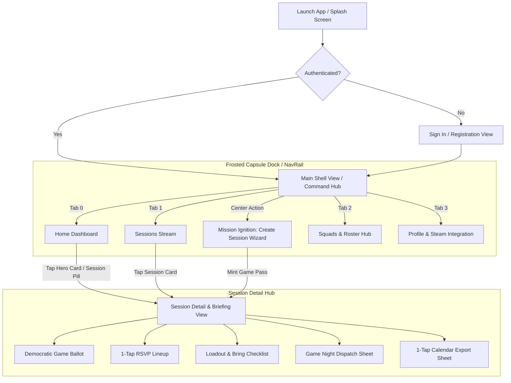
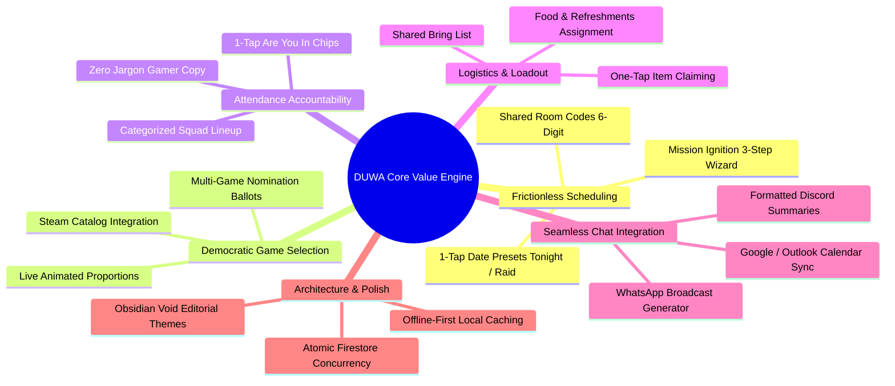

# CHAPTER 3: DEMONSTRATING THE MOBILE APPLICATION

## Project Title: DUWA – Social Game Night Coordination & Tabletop Hub
**Target Platform:** Mobile (Flutter / Android & iOS)  
**Backend Infrastructure:** Firebase (Authentication, Cloud Firestore, Cloud Messaging)  
**Primary Design Philosophy:** Editorial, Cinematic, Tactile (Obsidian Void Design System)

---

## VIII. User Interface Manual

This manual provides a comprehensive, step-by-step walkthrough of the DUWA mobile application. It documents the core user journeys, key screen interactions, tactile feedback mechanisms, and navigation architecture implemented across the Flutter client.



---

### 1. Step-by-Step User Journey Guide

#### Journey 1: Authentication and Profile Onboarding
1. **Initial Launch & Splash Screen:**
   * Upon launching the application, DUWA displays a branded splash screen featuring the animated hexagonal DUWA crest and initial state hydration.
   * If an active Firebase session token exists on device, the app transitions directly to the **Main Shell View** (`MainShellView`).
   * If unauthenticated, the user is routed to the **Authentication View** (`AuthView`).
2. **Account Creation & Sign In:**
   * Users can authenticate via Email/Password or single-tap guest preview.
   * Form fields feature real-time regex validation, responsive floating labels, and inline error styling.
3. **Gamer Profile Initialization:**
   * On first login, the user sets their primary **Gamer Tag**, optional **Bio/Status**, and selects an avatar or uploads an image via the Cloudinary camera/gallery pipeline.
   * Gamer profiles are immediately cached locally in `PreferencesService` to guarantee instant offline hydration on subsequent launches.

---

#### Journey 2: Navigating the Command Dashboard (`HomeView`)
The **Home Dashboard** acts as the user's primary command center, orchestrating pending tasks, active sessions, and rapid shortcuts.

```text
+-----------------------------------------------------------------+
|  [⬡ DUWA]                   ● Connected              [🔔 2] [👤]|
+-----------------------------------------------------------------+
|  GOOD EVENING, ALEX                                             |
|  2 days until your next raid • The Meeple Guild                 |
+-----------------------------------------------------------------+
|  (!) ACTION REQUIRED: VOTE FOR GAME                             |
|  "Friday Night Scramble" has an active ballot ending soon.      |
|  [ 🗳️ Cast Your Vote Now ]                                      |
+-----------------------------------------------------------------+
|  NEXT GAME NIGHT (HERO SESSION MARQUEE)                         |
|  +-----------------------------------------------------------+  |
|  | [KEY ART BANNER: TERRAFORMING MARS]                       |  |
|  | Saturday, Oct 24 • 7:30 PM (Starts in 1d 4h)              |  |
|  | Venue: Marco's Table • 124 Elm St                         |  |
|  | Squad: [A1] [A2] [A3] [A4] (4/5 Confirmed)                |  |
|  |-----------------------------------------------------------|  |
|  | ARE YOU IN?  [• I'M IN]        [ MAYBE ]       [ CAN'T GO ]|  |
|  +-----------------------------------------------------------+  |
+-----------------------------------------------------------------+
|  ACTION COMMAND BENTO HUB                                       |
|  +-----------------------------+  +--------------------------+  |
|  |  🚀 PLAN A SESSION          |  |  🔑 JOIN WITH CODE       |  |
|  |  Ignite a game night with   |  |  Quick enter via PIN     |  |
|  |  your squad in 3 quick steps|  +--------------------------+  |
|  |  [ + Start Planning ]       |  |  🎲 RANDOM GAME PICKER   |  |
|  |                             |  |  Spin squad backlog      |  |
|  +-----------------------------+  +--------------------------+  |
+-----------------------------------------------------------------+
|  UPCOMING SESSIONS                                 See All (3) >|
|  +-----------------------------------------------------------+  |
|  | [Art] ROOT: WOODLAND WAR • Wed, 8:00 PM • 4 Playing       |  |
|  +-----------------------------------------------------------+  |
|  | [Art] DUNE: IMPERIUM • Nov 02, 6:00 PM • Voting Active 🗳️ |  |
|  +-----------------------------------------------------------+  |
+-----------------------------------------------------------------+
|      [ 🏠 Home ]      [ 📅 Sessions ]      [ 👥 Squads ]        |
+-----------------------------------------------------------------+
```

1. **Contextual Priority Banner:**
   * If the user has a pending invitation, an active voting ballot, or unassigned loadout responsibilities, an urgent callout banner dynamically surfaces at the top of the feed.
   * Tapping the banner directly routes to the relevant session section.
2. **Hero Game Pass Marquee:**
   * Prominently highlights the squad's immediate next game session with official Steam CDN artwork scrim, live start countdown, host handle, and venue details.
   * **1-Tap RSVP Feedback:** The user can tap `I'M IN`, `MAYBE`, or `CAN'T GO` directly on the card. Selecting an option triggers an `AnimatedScale` bounce, a luminous border accent, physical haptic clicks (`HapticFeedback.lightImpact()`), and an atomic Firestore update.
3. **Bento Action Hub:**
   * **Plan a Session Tile:** Spans 2 rows with a vibrant gradient launch button opening the **Mission Ignition Wizard**.
   * **Join with Code Tile:** Launches `JoinCodeDialog` to instantly enter a 6-digit session or squad room code.
   * **Random Game Picker Tile:** Opens `RandomGameSheet`, randomly picking a backlog title matching current squad player capacity.
4. **Upcoming & Recent Game Feeds:**
   * Horizontally scrollable list of upcoming game passes and archived session history showing play durations and game winners.

---

#### Journey 3: Creating a Session (`Mission Ignition: Create Game Night Sheet`)
The creation experience uses a 3-stage guided modal sheet (`CreateGameNightSheet`) designed to eliminate scheduling friction.

```text
===================================================================
STAGE 1: LAUNCH TIMING & SQUAD SELECTION
===================================================================
1. Select Target Squad:
   Choose from your joined squads (e.g., "The Meeple Guild").
2. Choose Time Preset or Custom Schedule:
   - [ Tonight, 8:00 PM ]
   - [ Tomorrow, 7:30 PM ]
   - [ Friday Night Raid ]
   - [ Weekend Afternoon ]
   - [ Custom Date & Time Picker ]
3. Tap "Next: Select Games >"

===================================================================
STAGE 2: TARGET GAME SELECTION & SQUAD VOTING
===================================================================
1. Mode Selection:
   - Direct Game Mode: Select a single definitive title.
   - Squad Voting Mode: Toggle switch ON to nominate 2 to 4 games.
2. Browse or Search Catalog:
   - Filter through Steam integration library, squad favorites, or
     tap "+ Add Custom Game" to enter title and player limits.
3. Tap "Next: Logistics & Squad >"

===================================================================
STAGE 3: LOGISTICS, VENUE & LOADOUT CHECKLIST
===================================================================
1. Session Name: Pre-filled or personalized (e.g., "Friday Catan Showdown").
2. Venue / Voice Channel:
   - Presets: [ Host's House ] [ Discord Voice ] [ Board Game Cafe ]
   - Or enter physical address or paste Discord voice URL.
3. Squad Bring List (Loadout):
   - Add items needed: "2 Extra Xbox Controllers", "Snacks & Drinks",
     "Base Game + Expansion".
4. Tap "Ignite & Dispatch" -> Launches Step 4 Celebration!

===================================================================
STAGE 4: IGNITION CELEBRATION & MINTED GAME PASS
===================================================================
- Full-screen Confetti explosion triggers (`ConfettiController`).
- Minted digital Game Pass displays unique 6-digit Room Code (e.g., `#GM-782194`).
- Quick actions:
  [ 📋 Copy Invite Code ]  [ 🚀 Squad Dispatch ]  [ View Game Night ]
```

---

#### Journey 4: Participating in a Live Session (`GameNightDetailsView`)
The session details view acts as the real-time multiplayer command briefing:

```text
+-----------------------------------------------------------------+
| [< Back]               SESSION BRIEFING             [📅] [🚀] [⋮]|
+-----------------------------------------------------------------+
| [ STEAM KEY ART SCRIM: TERRAFORMING MARS                       ] |
| STATUS: READY TO PLAY                STARTS IN: 1d 4h 22m        |
| Organized by Marco • The Meeple Guild                           |
+-----------------------------------------------------------------+
|  COZY SCHEDULE & VENUE GRID                                     |
|  📅 Sat, Oct 24, 2026 • 7:30 PM      📍 Marco's Table (124 Elm) |
|  [ 🗓️ Add to Google / Outlook Calendar / .ICS                  ] |
+-----------------------------------------------------------------+
|  DEMOCRATIC BALLOT: WHAT ARE WE PLAYING? (VOTING ACTIVE)        |
|  +-----------------------------------------------------------+  |
|  | [Art] Terraforming Mars                 🗳️ 3 votes (60%)  |  |
|  | [========================░░░░░░░░░░░░░░░] [ You Voted ✓ ] |  |
|  +-----------------------------------------------------------+  |
|  | [Art] Dune: Imperium                    🗳️ 2 votes (40%)  |  |
|  | [================░░░░░░░░░░░░░░░░░░░░░░] [ Vote This ]   |  |
|  +-----------------------------------------------------------+  |
|  * Live animated voting bar recalculates on every tap.          |
+-----------------------------------------------------------------+
|  SQUAD LINEUP (ARE YOU IN?)                                     |
|  Your Status: [• I'M IN]         [ MAYBE ]         [ CAN'T GO ]  |
|                                                                 |
|  Confirmed (3): [Avatar Alex]  [Avatar Marco]  [Avatar Sarah]   |
|  Tentative (1): [Avatar Dave]                                   |
|  Can't Make It (1): [Avatar Chloe]                              |
+-----------------------------------------------------------------+
|  PREPARATION HUB & LOADOUT CHECKLIST                            |
|  Food & Refreshments: Pizza & Cold Brew (Marco ordering)        |
|  [x] Terraforming Mars Base Box  • Claimed by Alex              |
|  [x] Prelude Expansion           • Claimed by Marco             |
|  [ ] 2 Extra Player Mats         • [ Claim This Task ]          |
|  [ ] Ice & Sparkling Drinks      • [ Claim This Task ]          |
+-----------------------------------------------------------------+
|  [ 🚀 Squad Dispatch (Discord / WhatsApp Summary)              ] |
+-----------------------------------------------------------------+
```

1. **Democratic Game Ballot Interaction:**
   * If the session was initiated in voting mode, all nominated titles display real-time vote totals and percentages.
   * Tapping `Vote This` triggers `castVote()` via atomic Firestore transactions, preventing race conditions.
   * An animated proportion bar (`TweenAnimationBuilder`) smoothly resizes to display the shifting poll leader.
2. **Squad Lineup Spot Confirmation:**
   * One-tap response segmented bar: "I'M IN", "MAYBE", "CAN'T GO".
   * Avatars automatically reorder into grouped sections: *Confirmed*, *Tentative*, and *Can't Make It*.
3. **Preparation Hub & Bring List Claiming:**
   * Users can view the equipment and snacks needed for the night.
   * Tapping `[ Claim This Task ]` instantly binds the user's gamer tag to that item and triggers haptic feedback.
   * Any squad member can append new items to the loadout checklist.

---

#### Journey 5: External Squad Dispatch & Calendar Synchronization
DUWA bridges the gap between dedicated planning and chaotic chat apps through two native dispatch tools:

1. **Game Night Dispatch Sheet (`GameNightDispatchSheet`):**
   * Accessed via the rocket icon `[ 🚀 ]` in the top bar or bottom dock.
   * Formats a complete, beautifully organized session briefing into Markdown (for **Discord**) or styled unicode text (for **WhatsApp**).
   * **Generated Dispatch Content:**
     * Session Title, Target Game, and Scheduled Time.
     * Countdown and Venue / Voice Channel URL.
     * Active Squad Lineup ("Confirmed: Alex, Marco, Sarah").
     * Prep Checklist and Bring List status.
     * Embedded 6-digit Room Code with direct join instructions.
     * Auto-generated 1-tap **Google Calendar URL** for recipients who don't have the app installed yet.
   * Tapping `Copy Discord Briefing` or `Share via WhatsApp` triggers device haptics and copies the payload to the system clipboard.
2. **1-Tap Calendar Export (`CalendarExportSheet`):**
   * Accessible directly from the schedule grid.
   * **Google Calendar:** Launches direct RFC-compliant TEMPLATE URL converting session dates into UTC.
   * **Outlook Calendar:** Opens Outlook Web compose with pre-filled title, time, and notes.
   * **.ICS File:** Copies universal RFC-5545 iCalendar payload to clipboard for Apple Calendar, Thunderbird, and desktop clients.

---

#### Journey 6: Squads Hub & Roster Management (`GroupsView`)
1. **Browse Gaming Squads:**
   * Displays all friend groups the user is affiliated with (e.g., "The Meeple Guild", "Friday Night Raiders").
   * Summary metric cards display total squad count, total gamers, and active scheduled sessions.
2. **Create New Squad:**
   * Tap `[ + ]` to open squad builder: Enter squad name, description, emblem emoji, and invite squad mates.
3. **Squad Backlog & Library:**
   * Each squad maintains a shared catalog of games owned across its members.
   * Tapping any game in the squad library opens an instant prompt: `[ Plan Game Night with this Game ]`.

---

#### Journey 7: Profile, Steam Library & Design Vibes (`ProfileView`)
1. **Steam Account Synchronization (`SteamIntegrationView`):**
   * Connect a Steam profile or Steam ID64.
   * Automatically pulls owned games, header artwork, playtimes, and achievement milestones into the DUWA catalog.
2. **Design Vibe Theme Engine (`ThemeSelectorView`):**
   * Switch between curated aesthetic themes:
     * **Obsidian Void** (Default flagship: dark velvet charcoal, solar flame accents).
     * **Clean Light** (Crisp high-contrast editorial parchment).
     * **Mystic Ocean** (Deep cyan & indigo dark room).
     * **Bloom** (Warm editorial amber & terracotta).
   * Themes persist immediately across application restarts via `PreferencesService`.
3. **Session Cache Isolation & Safe Sign-Out:**
   * Tapping Sign Out securely clears scoped user caches, stream subscriptions, and notification listeners while retaining global theme preferences.

---

### 2. Key Interactions, Navigation Flows, and Interface Components

#### A. Interface Component Registry

| Component Name | File Location | Visual Metaphor & Purpose | Key Micro-Interactions |
| :--- | :--- | :--- | :--- |
| **`MainShellView`** | `lib/views/main_shell_view.dart` | Root responsive navigation scaffold | Uses `IndexedStack` to preserve tab scroll states; switches between Frosted Bottom Dock (<720px) and Navigation Rail (≥720px). |
| **`DuwaBottomNavBar`** | `lib/views/navigation/duwa_bottom_nav.dart` | Floating frosted glass capsule dock (`ImageFilter.blur`) | Radiant circular center launcher for session creation; indicator dot with scale bounce on tab switch. |
| **`HeroSessionMarquee`** | `lib/views/common/hero_session_marquee.dart` | Game Pass marquee card for immediate next session | Full-width Steam cover scrim, pulsing live urgency badge (`_PulseDot`), 1-tap interactive RSVP chips. |
| **`HomeBentoHub`** | `lib/views/home/home_bento_hub.dart` | Asymmetric 3-tile action grid (Mobbin standard) | Spring compression on tap (`BouncyTap`); high-contrast gradient primary card with contextual action subtitles. |
| **`GamePassCard`** | `lib/views/common/game_pass_card.dart` | Standardized game night pass card | Staggered entrance animation (`_StaggeredSessionEntry`), Steam cover art thumb, lineup pills, attention tags. |
| **`BouncyTap`** | `lib/views/common/bouncy_tap.dart` | Universal tactile touch wrapper | Physics-based spring scale (0.96 scale factor) on down-press with deceleration release curve. |
| **`CreateGameNightSheet`**| `lib/views/create/create_game_night_sheet.dart` | 3-stage guided modal creation wizard | Segmented step progress bar, custom date/time wheel pickers, live game search, Confetti explosion on finish. |
| **`GameNightDispatchSheet`**| `lib/views/details/game_night_dispatch_sheet.dart`| Multi-platform export generator | Segmented format switcher (Discord / WhatsApp), dynamic calendar URL embedding, 1-tap copy with haptics. |
| **`CalendarExportSheet`** | `lib/views/details/calendar_export_sheet.dart` | Native calendar deep-linking sheet | Instant external URL launching (`url_launcher`) for Google & Outlook; RFC-5545 `.ics` payload clipboard export. |

---

#### B. Screen Breakpoints & Adaptive Layout Rules

DUWA strictly enforces responsive ergonomics across mobile phones, foldables, and tablets:

```text
Compact Mobile (< 720px Width)            Tablet / Foldable (>= 720px Width)
+-----------------------------------+     +------+------------------------------------------+
| Top Bar (Logo, Alert Bell, Avatar)|     | [⬡]  | Header Bar (Title, Connection, Status)   |
|-----------------------------------|     |      |------------------------------------------|
| Scrollable Single Column Feed:    |     | [🏠] | Centered Constrained Content (Max 1040px)|
| - Priority Banner                 |     |      |                                          |
| - Hero Session Marquee            |     | [📅] | +-------------------+ +----------------+ |
| - Bento Action Hub (2x2 Grid)     |     |      | | Hero Session      | | Bento Hub      | |
| - Upcoming Game Pass Feed         |     | [+]  | | Marquee           | | 3-Tile Grid    | |
|-----------------------------------|     |      | +-------------------+ +----------------+ |
| Floating Frosted Capsule Dock     |     | [👥] |                                          |
|  [ 🏠 ]   [ 📅 ]   (+)   [ 👥 ]   |     |      | Staggered Dual-Column Grid Feed          |
+-----------------------------------+     | [👤] |                                          |
                                          +------+------------------------------------------+
```

* **Compact Form Factor (< 720px):** Single-column layout with vertical flow. The navigation resides in a floating frosted glass capsule elevated 16dp above the screen bottom.
* **Expanded Form Factor (≥ 720px):** The bottom bar automatically transforms into a persistent left-hand `DuwaNavRail`. The body content is wrapped in a `ConstrainedBox(maxWidth: 1040)` to preserve readable typography metrics and prevent stretched UI cards.

---

## IX. Feature Highlights

DUWA is engineered from the ground up to solve the universal pain points of social gaming: chaotic group chats, flaky attendance, decision paralysis over what game to play, and forgotten food or equipment.



---

### 1. Detailed Breakdown of Core Features

#### Feature 1: Mission Ignition – The 3-Step Creation Wizard
* **User Problem Solved:** Organizing a game night in Discord or WhatsApp typically requires 30+ scattered messages back and forth: *"When are we playing?"*, *"Whose house?"*, *"What time works?"*. By the time a date is picked, participants have lost interest.
* **How DUWA Solves It:** 
  The **Mission Ignition Wizard** compresses the entire planning lifecycle into three intuitive steps taking less than 45 seconds:
  1. *Timing & Squad:* Pick a squad and tap a smart preset (`Tonight 8:00 PM`, `Friday Night Raid`, `Weekend Afternoon`) or choose a custom time.
  2. *Game Choice:* Nominate a single title or activate squad voting.
  3. *Logistics:* Choose host home or Discord voice channel, and list items to bring.
* **Impact on User Experience:** Transforms a frustrating coordination chore into an exciting, frictionless staging process concluded with an celebratory minted Game Pass.

---

#### Feature 2: Democratic Game Ballot with Real-Time Vote Proportions
* **User Problem Solved:** Decision paralysis. Squads waste an hour debating what game to play while standing around the table or waiting in a voice channel.
* **How DUWA Solves It:**
  Hosts can initiate sessions in **Squad Voting Mode**, nominating 2 to 4 candidate games (e.g., *Root* vs *Dune: Imperium* vs *Terraforming Mars*). 
  * Squad members vote directly from their dashboard or session briefing with a single tap.
  * Live animated proportion bars (`TweenAnimationBuilder`) visually represent the race in real time.
  * Firestore atomic transactions prevent double-voting and race conditions.
  * The host can tap `Close Voting & Pick Winner` to automatically lock in the winning title.
* **Impact on User Experience:** Replaces endless arguments with fair, democratic consensus before players even leave their homes.

---

#### Feature 3: Frictionless "ARE YOU IN?" Attendance Lineup
* **User Problem Solved:** The classic "flaking" problem where attendees post vague responses in chat (*"Maybe"*, *"I'll try"*, *"What time again?"*), leaving the host unsure if they have enough players to meet the game's minimum count.
* **How DUWA Solves It:**
  DUWA completely discards clinical corporate jargon like "RSVP" in favor of natural gamer vernacular: **"ARE YOU IN?"**.
  * Players respond in a single tap via tactile chips: `I'M IN`, `MAYBE`, or `CAN'T GO`.
  * The lineup is visually partitioned into confirmed, tentative, and unavailable avatars.
  * The session pass dynamically displays quorum alerts (e.g., *"4/5 Confirmed • Quorum Met"*).
* **Impact on User Experience:** Clear, instant headcount visibility prevents cancelled nights and allows hosts to plan table seating accurately.

---

#### Feature 4: Collaborative Loadout & Bring Checklist
* **User Problem Solved:** Game nights often stall because essential components are forgotten: *"Who brought the extra controllers?"*, *"Did anyone bring the expansion board?"*, *"Who is bringing drinks?"*.
* **How DUWA Solves It:**
  Every game session incorporates a dedicated **Preparation Hub & Bring List**:
  * Hosts add supplies, equipment, snacks, and drinks needed for the evening.
  * Any squad member can tap `[ Claim This Task ]` to take responsibility for that item.
  * The claimant's gamer tag is bound to the task, providing immediate accountability.
* **Impact on User Experience:** Eliminates redundant duplicate snacks (e.g., three people bringing chips and nobody bringing drinks) and guarantees critical gaming gear arrives at the table.

---

#### Feature 5: Multi-Platform Squad Dispatch Generator
* **User Problem Solved:** Even when a game night is organized, getting non-app users or casual squad members on the same page requires manually retyping details into group chats.
* **How DUWA Solves It:**
  The **Game Night Dispatch Sheet** generates pre-formatted, beautiful status briefings with one click:
  * **Discord Mode:** Formatted with rich Markdown bolding, quote blocks, bullet lists, and emoji accents tailored for Discord desktop and mobile channels.
  * **WhatsApp Mode:** Formatted with WhatsApp-native asterisks and line breaks for clean messaging.
  * **Auto-Generated Calendar Deep-Links:** Automatically embeds a direct Google Calendar URL inside the chat export so friends who haven't yet downloaded DUWA can still add the session to their personal calendars with one tap.
* **Impact on User Experience:** Makes the session host look exceptionally organized while allowing the squad to coordinate wherever they already chat.

---

#### Feature 6: 1-Tap Universal Calendar Synchronization
* **User Problem Solved:** Forgotten game sessions caused by disconnects between chat invitations and personal scheduling apps.
* **How DUWA Solves It:**
  DUWA's `CalendarService` generates RFC-compliant integrations without requiring external dependencies or third-party paid APIs:
  * **Google Calendar:** Converts scheduled timestamps to UTC and opens an official Google Calendar template with pre-filled title, location, and description.
  * **Outlook Calendar:** Direct deep-link compose integration for Outlook Web.
  * **.ICS Clipboard Copy:** Full RFC-5545 compliant iCalendar payload that can be pasted or imported into Apple Calendar or desktop clients.
* **Impact on User Experience:** Game nights seamlessly sync into players' everyday schedules alongside their work and personal commitments, drastically reducing no-shows.

---

#### Feature 7: Squads Hub & Game Library Backlog
* **User Problem Solved:** Friend groups often forget what games are owned across the group or struggle to integrate new members into their recurring game nights.
* **How DUWA Solves It:**
  * Organizes friends into persistent squads (e.g., Tabletop Guild, Warzone Crew, LAN Group).
  * Maintains a shared game backlog across all members.
  * Allows rapid session scheduling directly from any squad card or game card via `Plan Game Night for this Squad`.
* **Impact on User Experience:** Builds a sense of shared identity and catalog pride across recurring gaming circles.

---

#### Feature 8: Steam Catalog & Key Art Integration
* **User Problem Solved:** Generic gaming apps rely on low-resolution user uploads or boring text-only lists that feel stale and uninspiring.
* **How DUWA Solves It:**
  * DUWA integrates directly with the official Steam CDN key art infrastructure.
  * Selecting popular titles automatically fetches official wide-format banners, minimum/maximum player counts, and genre tags.
  * Users can link their Steam ID to sync owned titles directly into their personal DUWA backlog.
* **Impact on User Experience:** Delivers an editorial, cinematic presentation akin to Steam Deck or Apple Arcade, elevating anticipation for every game night.

---

#### Feature 9: Curated Multi-Theme Engine (`Obsidian Void`)
* **User Problem Solved:** Gamer apps are frequently plagued by tacky "AI neon slop" (harsh pure black `#000000` with eye-straining magenta and cyan neon lines).
* **How DUWA Solves It:**
  DUWA's design system adheres strictly to the **Obsidian Void** aesthetic:
  * Deep charcoal velvet canvas (`#080A10`), elevated surface cards (`#121624`), luminous amber borders, and Solar Flame (`#FF5E1E`) primary accents.
  * Alternative palettes (**Clean Light**, **Mystic Ocean**, **Bloom**) ensure accessibility in any lighting condition.
  * All tokens are theme-aware and persist permanently via `PreferencesService`.
* **Impact on User Experience:** Delivers a premium, editorial visual feel that respects the user's aesthetic standards.

---

#### Feature 10: Offline-First Reliability & Atomic Concurrency
* **User Problem Solved:** Mobile network dropouts during transit or in basement gaming venues can cause app crashes, data corruption, or lost votes.
* **How DUWA Solves It:**
  * **Local Profile & Session Hydration:** User profiles, cached sessions, and theme preferences load instantly from local storage before network responses arrive.
  * **Atomic Firestore Transactions:** Voting (`castVote()`) and spot confirmation (`updatePlayerRsvp()`) utilize Firestore atomic `runTransaction` blocks to guarantee thread safety when multiple squad members interact simultaneously.
  * **Scoped User Isolation:** Firestore queries are scoped strictly to sessions and squads where the authenticated user is a participant or creator.
* **Impact on User Experience:** Guarantees zero latency on initial startup, bulletproof consistency under concurrent usage, and complete user data privacy.

---

### 2. Feature-to-User Need Mapping Matrix

| Feature | Target User Need / Pain Point | Mechanism / Technical Solution | Measurable UX Benefit |
| :--- | :--- | :--- | :--- |
| **Mission Ignition Wizard** | High scheduling friction in messaging chats | 3-step modal flow with smart time presets | Cuts session creation time from 15 minutes of chat to under 45 seconds |
| **Democratic Game Ballot** | Decision paralysis and endless game arguments | Multi-game nomination poll with live proportion bars | Achieves democratic consensus prior to the session start |
| **1-Tap Lineup ("ARE YOU IN?")** | Flaky attendance and unclear player headcounts | Tactile response chips (`I'M IN`, `MAYBE`, `CAN'T GO`) | Instant headcount visibility; automatic quorum validation |
| **Loadout & Bring Checklist** | Forgotten cables, controllers, boards, and snacks | Shared checklist with 1-tap task claiming | Eliminates forgotten game components and duplicate snack purchases |
| **Game Night Dispatch Sheet** | Re-typing session logistics into Discord/WhatsApp | Pre-formatted markdown/unicode summary generator | Instant 1-tap copy & dispatch to existing squad chat channels |
| **1-Tap Calendar Export** | Missed game nights due to lack of calendar sync | RFC-5545 .ics generator & direct Google/Outlook URLs | Zero-effort synchronization into personal digital calendars |
| **Steam Key Art Integration** | Low-quality imagery and boring text lists | Direct Steam CDN banner fetch & Steam ID syncing | High-impact, cinematic presentation across all session passes |
| **Offline Cache & Atomic Rules** | Slow network loading & concurrency vote collisions | `PreferencesService` local cache & Firestore `runTransaction` | Instant app launch (<200ms) and zero vote race conditions |

---

### 3. Summary of User Experience Impact

The combination of the **User Interface Manual** and **Feature Highlights** demonstrates how DUWA transcends traditional calendar or to-do list utilities:
1. **Focus on Gamer Culture:** From natural conversational copy to Steam key art integration, every interaction is tailored specifically for tabletop and video game crews.
2. **Tactile Ergonomics:** Incorporating physics-based spring taps (`BouncyTap`), smooth proportion animations (`TweenAnimationBuilder`), and device haptic clicks makes every button press feel physical and satisfying.
3. **Frictionless Bridge to Existing Habits:** Rather than forcing every friend to install a new app before a game night can even happen, DUWA meets friend groups where they are through one-click **Discord/WhatsApp Dispatching** and universal **Calendar Deep-Links**.

DUWA bridges the gap between chaotic group chats and the actual gaming table, turning the dread of scheduling into the exciting prelude to a great game night.
